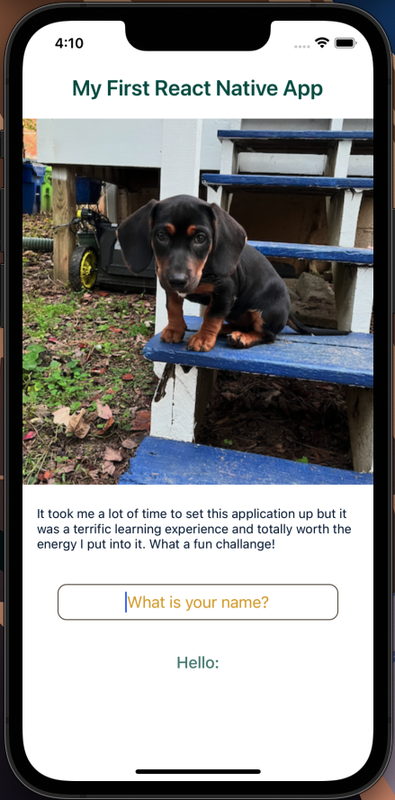
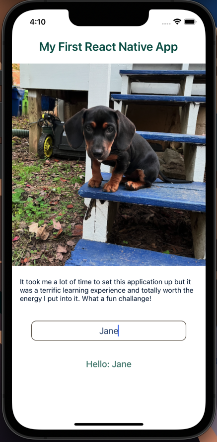

# My First React Native App

run "npx react-native run-ios" in your project directory to generate a React Native App

A coding tutorial created to review and practice basic JavaScript by creating a question and answer game. Completed through Mammoth Interactive at [link to Mammoth Interactive Homepage](https://training.mammothinteractive.com/courses).

## Tech Used
- Java
- TypeScript
- Ruby
- Objective-C
- Obj-C++
- JavaScript

## Dependencies
- React
- React Native

## Uses
My first React Native project. Installing it was a bit of a challenge but I found a few tutorials to guide me along.

## What I did with this project
- used typescript instead of javascript
- used onChangeText attribute to display a welcome message
- figured out how to adjust th eimage width vs height ratios and created viewport and ratio constants to make it work
- found my own color scheme
- Aligned components beyond what the tutorial's guidance

## History
After completing a Software Engineering certification program and during my job search, I needed to continue to pracitce my skill set in order to maintain it and learn more. I wanted to create this project to gain some experience with the React Native.

## Screenshot 1

## Screenshot 2

